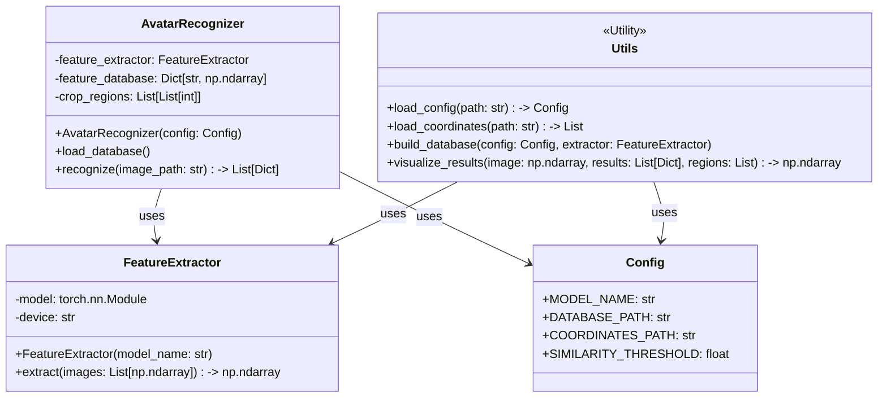

### **开发文档：基于图像检索的游戏角色头像识别系统**

*   **版本**: 2.1 (工程化增强版)
*   **文档目的**: 本文档旨在明确一个游戏角色头像识别系统的设计与实现方案。该系统能够从一张布局固定的游戏截图中，识别出每个位置的角色头像分别对应头像库中的哪一位。本文档将作为AI或开发人员进行后续代码实现的最终技术指南。

---

### **1. 项目概述 (Project Overview)**

#### 1.1 项目目标
开发一个自动化工具，用于识别特定游戏截图中的所有角色头像。该截图具有完全固定的尺寸和布局。系统的核心能力是，根据预定义的坐标裁剪出所有头像，然后与一个包含一百多个角色的标准头像库进行匹配，并返回每个位置的识别结果。

#### 1.2 核心问题
该问题属于计算机视觉领域的**实例识别 (Instance Recognition)** 或 **图像检索 (Image Retrieval)**，并通过利用固定的图像布局进行了大幅简化。

#### 1.3 技术选型
我们采用**基于深度学习的图像检索方案**，并结合**固定坐标模板裁剪**。此方案利用一个强大的预训练模型作为通用特征提取器，将图片转换为高维特征向量（Embedding）。通过比较向量间的相似度来实现识别。此方案具有以下优点：
*   **高准确性**: 深度学习模型能有效识别卡通风格图像，且对微小差异不敏感。
*   **高效率与稳定性**: 固定的坐标裁剪取代了耗时且不稳定的动态目标检测。
*   **极佳的扩展性**: 增删角色时，仅需更新特征数据库，无需重新训练模型。

---

### **2. 系统架构 (System Architecture)**

系统分为两个主要工作流：**离线数据库构建** 和 **在线识别**。

#### 2.1 离线工作流：特征数据库构建
此流程为一次性操作，当头像库更新时执行。

`[标准头像库]` -> `[特征提取模块 (批处理)]` -> `[特征向量数据库 (持久化存储)]`

#### 2.2 在线工作流：实时识别
此流程用于处理新的游戏截图。

`[待识别游戏截图]` -> `[1. 坐标裁剪模块]` -> `[裁剪出的头像列表]` -> `[2. 特征提取模块 (批处理)]` -> `[查询向量列表]` -> `[3. 向量匹配模块]` -> `[最终识别结果]` -> `(可选) [4. 结果可视化]`

---

### **3. 模块详细设计 (Detailed Component Design)**

#### 3.1 特征提取模块 (Feature Extractor)
*   **目的**: 将任意图像（标准头像或裁剪出的头像）高效地转换为固定维度的特征向量。
*   **输入**: 一个包含多张RGB图像的列表 (批处理)。
*   **输出**: 一个二维的Numpy浮点数数组，每行代表一个图像的特征向量。
*   **模型选型**: 鉴于头像是**卡通风格**，采用通用的图像识别模型 **`EfficientNet-B0`** (通过 `timm` 库加载)。该模型在性能和计算效率之间取得了极佳的平衡。模型名称将通过配置文件进行管理，方便切换。
*   **实现**: 加载 `timm.create_model(config.MODEL_NAME, pretrained=True)`，并将其最后的分类层 (`model.classifier`) 替换为 `torch.nn.Identity()`。**关键优化：输入应为一个批次 (batch) 的图像张量，以充分利用GPU并行计算能力**。输出的特征向量需进行L2归一化，以便后续使用余弦相似度进行高效比较。

#### 3.2 特征向量数据库 (Feature Vector Database)
*   **目的**: 存储标准头像库中每个角色的特征向量及其对应的角色名。
*   **结构**: 一个键值对（Key-Value）结构。
    *   **Key**: 角色名称 (字符串, e.g., "character_a")。
    *   **Value**: 对应的特征向量 (Numpy Array)。
*   **存储方式**: 将该字典结构保存为单个 `.npy` 文件（路径由配置文件指定），使用 `numpy.save`。程序启动时通过 `numpy.load(..., allow_pickle=True).item()` 加载到内存中。

#### 3.3 固定坐标裁剪模块 (Fixed-Coordinate Cropping Module)
*   **目的**: 在输入的大图上，根据外部定义的坐标模板，直接裁剪出所有头像的图像区域。
*   **坐标来源**: **不再硬编码于代码中**。坐标模板将从一个外部 `JSON` 文件（例如 `coordinates.json`，路径由配置文件指定）加载。这使得在UI布局变化时，只需修改该文件即可。
*   **实现步骤**:
    1.  **定义坐标模板 (一次性工作)**:
        *   创建一个 `JSON` 文件，其内容为一个列表，例如 `[{"name": "pos1", "rect": [x, y, w, h]}, ...]`。
        *   这些坐标需要通过图像编辑工具或代码手动测量得出。
        *   **关键优化**: 测量时，**故意将裁剪框的左上角向右下方偏移，并适当减小宽高，以确保裁剪出的区域完全不包含左上角的UI图标**。
    2.  **执行裁剪**:
        *   编写一个函数，输入大图路径和从 `JSON` 文件加载的坐标模板列表。
        *   函数内部使用 `cv2.imread` 读取图像，然后遍历坐标模板，使用Numpy数组切片 `img[y:y+h, x:x+w]` 快速裁剪。
        *   返回一个包含所有裁剪出的头像图像（Numpy Array格式）的列表。

#### 3.4 向量匹配模块 (Vector Matching Module)
*   **目的**: 为一个查询向量，在特征数据库中找到最相似的匹配项。
*   **输入**: 一个查询向量和整个特征向量数据库。
*   **输出**: 最匹配的角色名称和对应的相似度得分。
*   **实现细节**:
    *   **相似度度量**: 使用**余弦相似度 (Cosine Similarity)**，通过 `sklearn.metrics.pairwise.cosine_similarity` 计算。
    *   **匹配逻辑**: 遍历数据库中所有向量，计算查询向量与它们的余弦相似度，取分值最高的作为结果。
    *   **阈值处理**: 设置一个**可配置的**相似度阈值（从配置文件读取，建议初始值为 `0.85`）。如果最高分仍低于此阈值，则将该头像标记为“未知”(Unknown)。

---

### **4. 配置管理 (Configuration Management)**

为了提高系统的灵活性和可维护性，所有关键参数都将通过一个外部配置文件（例如 `config.yaml`）进行管理。

```yaml
# config.yaml
model:
  name: "efficientnet_b0"

paths:
  database: "data/feature_database.npy"
  coordinates: "data/coordinates.json"
  avatar_library: "data/avatars"
  output_dir: "output"

recognition:
  similarity_threshold: 0.85
```

---

### **5. 数据规范 (Data Specification)**

*   **标准头像库**:
    *   **内容**: 应包含**干净、无任何游戏内UI遮挡**的标准角色头像。
    *   **路径**: 由配置文件中的 `paths.avatar_library` 指定。
    *   **格式**: `PNG`, `JPG` 等标准图像格式。
    *   **命名**: 文件名（不含扩展名）将作为角色ID。例如，`白雪公主.png` 的角色名将被解析为 "白雪公主"。
*   **待识别大图**:
    *   **内容**: 布局和尺寸完全固定的游戏截图。
    *   **格式**: `PNG`, `JPG` 等。

---

### **6. API 与代码结构 (API & Code Structure)**

系统将采用面向对象的方式进行封装，以提高模块化和可维护性。

#### 6.1 核心类设计



#### 6.2 主调用接口

最终的调用方式将非常简洁：

```python
from recognizer import AvatarRecognizer, Utils

# 1. 加载配置
config = Utils.load_config('config.yaml')

# 2. 初始化识别器
recognizer = AvatarRecognizer(config)

# 3. 执行识别
results = recognizer.recognize('path/to/game_screenshot.png')

# 4. (可选) 可视化结果
# ...
```

---

### **7. 关键依赖 (Key Dependencies)**

*   `torch` & `torchvision`
*   `timm`
*   `opencv-python`
*   `numpy`
*   `scikit-learn`
*   `pyyaml` (用于解析配置文件)

---

### **8. 实施计划 (Implementation Plan)**

1.  **环境搭建**: 安装上述所有Python依赖库。
2.  **配置文件与数据准备**:
    *   创建 `config.yaml` 并填入初始参数。
    *   创建 `data/` 目录，并手动测量坐标，生成 `data/coordinates.json`。
    *   将所有标准头像放入 `data/avatars/` 目录。
3.  **工具类实现 (`Utils`)**:
    *   实现 `load_config` 和 `load_coordinates` 函数。
    *   实现 `visualize_results` 函数，用于在图片上绘制识别结果。
4.  **特征提取器实现 (`FeatureExtractor`)**:
    *   封装 `timm` 模型加载逻辑。
    *   实现 `extract` 方法，确保其能接收**图像批次**并返回特征向量批次。
5.  **数据库生成脚本**:
    *   利用 `Utils` 和 `FeatureExtractor`，编写一个独立的 `build_db.py` 脚本。
    *   该脚本读取标准头像库，通过批处理生成所有特征向量，并保存为 `feature_database.npy`。
6.  **核心识别器实现 (`AvatarRecognizer`)**:
    *   实现 `__init__` 方法，加载配置、坐标和特征数据库。
    *   实现 `recognize` 方法，将裁剪、特征提取和向量匹配的流程串联起来。
7.  **端到端测试与调优**:
    *   编写主调用脚本（如 `main.py`）。
    *   使用实际游戏截图进行测试，并根据结果在 `config.yaml` 中微调**相似度阈值**。